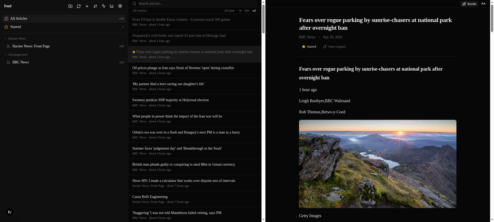

# Feed

A local-first RSS/Atom reader. Runs entirely on your machine, stores everything in a single SQLite file, and requires zero accounts or API keys. Dark-mode-first, keyboard-navigable, designed for focused reading.

> Closer in spirit to Reeder or Matter than to Feedly. No cloud, no algorithm, no ads.



## Features

**Reading**
- Three-pane resizable layout — sidebar, article list, reading pane
- Reader mode with Mozilla Readability content extraction
- Article highlights — select text to save persistent annotations
- Typography settings — adjustable font size, line height, content width
- Code-block syntax highlighting in articles (highlight.js)
- Image proxy for blocked or mixed-content images

**Organization**
- Feed folders with rename, delete, and drag-to-move
- Full-text search powered by SQLite FTS5
- Command palette (`Cmd+K` / `Ctrl+K`) for quick navigation
- Date range filters — today, past week, past month, all time
- Mark all as read — per feed or across the current view

**Feed management**
- Auto-refresh with configurable per-feed intervals
- OPML import and export
- Feed health dashboard — frequency, freshness, error metrics
- Retention policy — automatic pruning of old read articles (preserves starred, highlighted, unread)

**Export & backup**
- Starred articles as Markdown or JSON
- OPML for feed subscriptions
- Full data backup & restore — JSON export/import of feeds, articles, highlights, and settings

**Interface**
- Dark-mode-first design using oklch color tokens
- Mobile-responsive layout with swipe gestures
- Keyboard shortcuts for everything: `j`/`k`, `s`, `m`, `r`, `o`, `Cmd+K`

## Quick start

```bash
git clone https://github.com/Gares95/Feed.git
cd Feed
npm run setup       # install + generate Prisma client + run migrations
npm run dev         # http://localhost:3000
```

Open the app, click `+`, paste a feed URL, and start reading.

## Commands

```bash
npm run setup       # First-time setup
npm run dev         # Dev server (Turbopack) on http://localhost:3000
npm run build       # Production build
npm run lint        # ESLint
npm run test        # Vitest
npm run test:watch  # Vitest in watch mode
npx prisma studio   # Browse the SQLite database
```

## Tech stack

| Layer | Choice |
|---|---|
| Framework | Next.js 15 (App Router), React 19, TypeScript 5 (strict) |
| Styling | Tailwind CSS v4, shadcn/ui (New York), Lucide icons |
| Database | Prisma 6 + SQLite (single file at `prisma/dev.db`) |
| Feed parsing | rss-parser, DOMPurify + jsdom for HTML sanitization |
| Layout | react-resizable-panels |
| Testing | Vitest + React Testing Library |

## Architecture

```
Add feed URL  →  POST /api/feeds  →  fetch RSS → parse XML → sanitize → SQLite
Read articles →  Server Components query Prisma → render three-pane layout
Mutations     →  Server Actions → SQLite → optimistic UI update
```

- **Server-side feed fetching only** — no client-side RSS fetches (CORS/security)
- **SSRF-safe outbound HTTP** — every server-side request (feed fetch, article extraction, image proxy, feed discovery) runs through `lib/safe-fetch.ts`, which resolves DNS and blocks loopback/RFC1918/link-local/cloud-metadata ranges, revalidates each redirect, and caps response size
- **Full article HTML stored in SQLite** — reading is instant, no network needed
- **All feed HTML sanitized with DOMPurify** before rendering; anchors are forced to `rel="noopener noreferrer nofollow"` to neutralise tab-nabbing and block Referer leakage
- **Server Actions for mutations** — API routes only for complex server-only operations
- **No client state library** — React Context for UI state, Server Components for data

## Project layout

```
src/
├── app/              # Pages and API routes (App Router)
│   ├── api/          # feeds, articles, opml, image-proxy, export, backup
│   ├── health/       # Feed health dashboard
│   ├── stats/        # Reading statistics
│   ├── settings/     # Retention policy, backup & restore
│   └── page.tsx      # Three-pane reader
├── actions/          # Server Actions (feeds, articles, folders, retention, highlights)
├── components/
│   ├── layout/       # AppShell (resizable three-pane)
│   ├── sidebar/      # Sidebar, FeedItem, AddFeedDialog, OpmlActions
│   ├── articles/     # ArticleList, ArticleRow
│   ├── reader/       # ReadingPane, ArticleHeader, TypographySettings
│   ├── settings/     # RetentionSettings, BackupSettings
│   └── ui/           # shadcn primitives
├── lib/              # feed-parser, sanitize, retention, settings, queries, …
├── hooks/            # useKeyboardShortcuts, useAutoRefresh, …
└── generated/prisma  # Prisma client (custom output path)
prisma/
├── schema.prisma
└── migrations/
```

## Keyboard shortcuts

| Key | Action |
|---|---|
| `j` / `↓` | Next article |
| `k` / `↑` | Previous article |
| `Enter` / `o` | Open article / original link |
| `s` | Toggle star |
| `m` | Toggle read/unread |
| `r` | Refresh current feed |
| `R` | Refresh all feeds |
| `a` | Add new feed |
| `Cmd+K` / `Ctrl+K` | Command palette |

## Privacy

Everything lives in `prisma/dev.db`. No telemetry, no third-party requests beyond fetching the feeds you subscribe to. Back up the project directory to back up all your data.

The dev and production servers bind to `127.0.0.1` only, so the app is not reachable from other devices on your network. If you want LAN access (e.g. reading from your phone at home), run it behind a reverse proxy with its own auth (nginx basic-auth, Tailscale) rather than exposing the raw Node server — the API routes assume a single trusted user.

## Roadmap

See [`PROJECT_BLUEPRINT.md`](./PROJECT_BLUEPRINT.md) for the full phased roadmap, design tokens, database schema, and architectural rationale. Phases 1-3 and most of Phase 5 are complete. Phase 4 (optional AI features via Ollama or user-provided API keys) is intentionally deferred.

## License

Personal project — no license declared.
