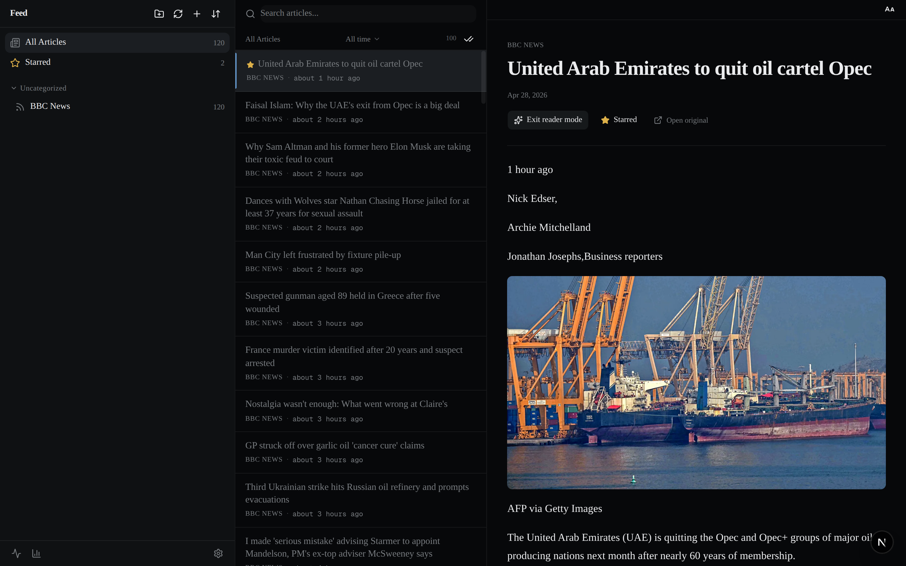
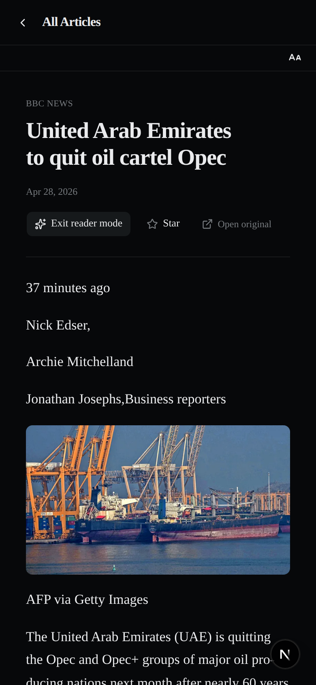

# Feed Skill Lab

Public UI/design-skills experiment for [Feed](https://github.com/Gares95/Feed). This repo is where Claude Code, Claude Design, and the Claude Skills system are tested as tools for redesigning, polishing, and re-imagining a real working app.

## Relationship to canonical Feed

- [`Gares95/Feed`](https://github.com/Gares95/Feed) — the stable canonical local-first RSS/Atom reader.
- [`Gares95/feed-skill-lab`](https://github.com/Gares95/feed-skill-lab) — this repo, the public design lab.

This is **not** a GitHub fork. GitHub does not allow forking a repository into the same owner account, so the lab was bootstrapped by cloning canonical Feed at the `v1.0.0` release tag, resetting history, and pointing at a new origin. Canonical Feed is tracked here as the `upstream` remote and patch-level fixes (server actions, schema, sanitization, safe-fetch, retention, parsing, search, shared dependency versions) are cherry-picked from it via release tags.

The lab preserves Feed's data model, server actions, Prisma schema, API routes, persistence model, and core RSS/Atom behavior unless explicitly noted. **UI, layout, chrome, typography, motion, navigation, and interaction design are the experimental surface.**

## Current Status

| Track | Status |
|---|---|
| Incremental polish | Complete |
| Radical concepts | Next |
| Hosted demos | Deferred |

The current default branch is the **polished baseline** — the result of running an incremental design-skill-guided polish track over the v1.0.0 baseline. The next phase is radical UI concept exploration on dedicated `concept/*` branches.

## Polished Baseline



<details>
<summary>Mobile view</summary>



</details>

The polished baseline lands the following design-skill passes on top of v1.0.0:

- Theme tokens and Geist font system
- Article row hierarchy (title weight, meta line, selection indicator)
- Focus states and accessibility basics
- App chrome (sidebar density, header alignment, divider system)
- Reading-pane typography (measure, leading, code-block treatment)
- Loading and empty states
- In-app dialogs (Add Feed, Command Palette, settings panels)
- Subtle motion pass (reader cross-fade, popover, star toggle, `prefers-reduced-motion`)
- A11y pass
- Button-system pruning (variant inventory consolidated, sizes normalised)
- Mobile shell polish (safe-area insets, top-bar presence, `viewport-fit: cover`)
- Canonical `ScrollArea` flex-shrink fix inherited from Feed v1.0.2

See [`docs/design-lab/initial-design-skill-audit.md`](docs/design-lab/initial-design-skill-audit.md) for the full audit and per-branch progress notes.

## Experiment Tracks

| Track | Status | Purpose |
|---|---|---|
| Incremental polish | Complete | Make the baseline UI more refined and usable |
| Radical concepts | Planned / next | Explore substantially different UI directions |
| Selected upstreaming | Later | Move proven stable improvements back to canonical Feed |

## Radical Concepts Gallery

| Concept | Branch | PR | Status | Screenshot | Notes |
|---|---|---|---|---|---|
| Editorial Reader | `concept/01-editorial-reader` | TBD | Planned | TBD | Reader-first direction |
| Command Center | `concept/02-command-center` | TBD | Planned | TBD | Keyboard/action-first direction |
| Compact Pro | `concept/03-compact-pro` | TBD | Planned | TBD | Dense power-user direction |
| Magazine Dashboard | `concept/04-magazine-dashboard` | TBD | Planned | TBD | More visual discovery direction |

## How to Run Locally

```bash
git clone https://github.com/Gares95/feed-skill-lab.git
cd feed-skill-lab
npm run setup       # install + generate Prisma client + run migrations
npm run dev         # http://localhost:3000
```

To try a concept branch (once published):

```bash
git fetch origin
git checkout concept/01-editorial-reader
npm run setup
npm run dev
```

## What Stays Stable

These surfaces are intentionally identical to canonical Feed and follow it as `upstream`:

- Data model
- Server actions
- Prisma schema
- API routes
- SQLite / local-first persistence model
- RSS/Atom parsing and refresh behavior
- OPML import/export behavior (unless explicitly documented)
- Core reader behavior (Readability extraction, sanitization, safe-fetch)

## Deployment Status

- No hosted demos yet.
- Feed is a local-first app backed by SQLite at `prisma/dev.db`.
- A public deployment requires a safe demo mode with seeded data and risky actions disabled or mocked. That work is out of scope for the polish track.
- Deployment will be reconsidered for selected finalist concepts only.

## Documentation

- [`docs/design-lab/initial-design-skill-audit.md`](docs/design-lab/initial-design-skill-audit.md) — the original design-skill audit and per-branch implementation notes for the polish track.
- `docs/design-lab/concepts/` — per-concept design notes (added when each `concept/*` branch lands).

## License

MIT — see [`LICENSE`](./LICENSE).
